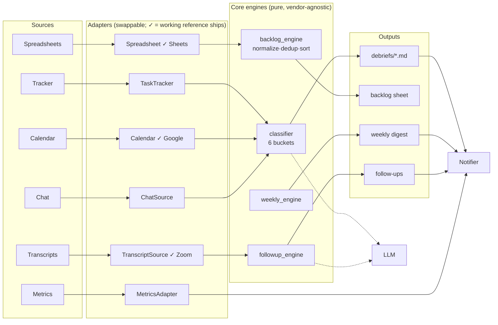

# claude-pm-os — a PM Operating System on Claude Code

[](https://github.com/smbochkarev1/claude-pm-os/actions/workflows/evals.yml)
&nbsp;[](https://github.com/smbochkarev1/claude-pm-os/actions/workflows/tests.yml)
&nbsp;
&nbsp;

A personal, reusable orchestration layer that turns a product manager's scattered
tools — tracker, calendar, spreadsheets, chat, meeting transcripts — into one
daily loop: an evening **debrief**, a morning **recap**, a weekly roll-up, one
deduped **cross-source backlog**, and automatic **post-meeting follow-ups**.

You run it locally and hand the repo to your own Claude Code. It's built around
swappable **adapters**, so it works with whatever stack you already have
(Jira/Linear/GitHub, Google Calendar/Outlook, Slack/Telegram, Zoom/Meet).

---

## 1. Problem

A PM drowns in sources. Status lives in five spreadsheets, three tracker queues,
a dozen chats, and yesterday's meeting no one wrote down. Keeping the backlog and
"who owes what" in sync is manual, and it silently eats hours every week. Nothing
falls through on purpose — it falls through because reconciling all of it by hand
doesn't scale.

## 2. What it does

- **Evening debrief** — pulls every source, classifies the day into six buckets
  (done / owed-by-me / waiting-on-others / decisions / risks / planned), writes a
  dated markdown file, and pushes a clean summary to your notifier.
- **Morning recap** — reconciles yesterday's debrief against today's reality and
  produces a focused "do this / ping them / decide this" list.
- **Weekly roll-up** — aggregates the week's debriefs into achievements, chronic
  items (stuck 2+ days), a decisions changelog, recurring risks, and patterns.
- **Cross-source backlog** — normalizes rows from many spreadsheets + live
  tracker + debrief-owed items, dedups them, prioritizes, and publishes one table.
- **Post-meeting follow-ups** — polls for meeting transcripts, extracts
  who-owns-what with correct owner attribution, and delivers a compact follow-up.
- **Midnight fallback** — if you forget to run the debrief, a headless job builds
  it at 23:00 so the history never has a gap.
- **Metrics watch** — a digest + freshness watchdog that alarms a team channel
  when a tracked metric breaches a threshold or a dashboard silently goes stale.

## 3. Architecture



Sources → adapters → core engines → outputs → notifier. The engines never import
a vendor SDK; they speak only the canonical dataclasses in `adapters/base.py`.

## 4. Impact

Author's personal results running this daily:

- **300+ tasks** consolidated into one deduped, prioritized backlog that used to
  live across five spreadsheets and several tracker queues.
- Automates **the equivalent of ~20–30 hours/week of manual work** — not personal
  time saved, but work that would otherwise be done by hand. Where the hours come from:
  - *Cross-source backlog:* reconciling 5 spreadsheets + several tracker queues by hand ≈ **6–8 h/week** → now a ~15-minute review of the generated diff.
  - *Daily debrief + weekly roll-up:* manually re-reading tracker/calendar/chat and writing status ≈ **5–7 h/week** → auto-drafted, you edit.
  - *Post-meeting follow-ups:* re-watching transcripts and extracting action items ≈ **4–6 h/week** → extracted automatically.
  - *Meeting prep + misc sync:* ≈ **5–8 h/week**.
- A debrief every working day, with zero gaps thanks to the midnight fallback.

(Personal case, not a benchmark — your mileage depends on your stack and habits.)

## 5. Example output

What the system actually produces, on a fully synthetic PM's day (no real people,
tickets, or data — generic `Acme checkout`, `Jordan`, `PAY-142`). These are the
same file formats a real run writes to `debriefs/`, the backlog sheet, and the
weekly roll-up:

- [`examples/sample-output/debrief-2026-03-14.md`](examples/sample-output/debrief-2026-03-14.md) — an evening debrief: the six buckets, each bullet carrying an inline source tag.
- [`examples/sample-output/recap-2026-03-15.md`](examples/sample-output/recap-2026-03-15.md) — the next morning's recap, reconciled against the debrief (closed items dropped, waiting-vs-ping resolved).
- [`examples/sample-output/weekly-2026-W11.md`](examples/sample-output/weekly-2026-W11.md) — the weekly roll-up: achievements, chronic items, decisions changelog, recurring risks, patterns.
- [`examples/sample-output/backlog-sample.csv`](examples/sample-output/backlog-sample.csv) — a slice of the deduped, prioritized cross-source backlog (`BL-NNN` ids, merged `source` column showing where each row came from).

A debrief opens like this — outcome-first, every line traceable to its source:

```markdown
## Done today
- Shipped the retry-on-decline flow for card payments to 20% of traffic [PAY-142]
- Closed the duplicate-charge investigation — root cause was a stale idempotency key, fix merged [PAY-138]
- Sent the finalized Q1 checkout scorecard to the Acme checkout team [chat / "Checkout squad" / msg 17:40]

## Owed by me — not done today
- I'll draft the rollback criteria for the retry-on-decline rollout before we go to 50% [PAY-142]
- I'll check the mobile tax-calculation edge case Dana flagged and reply in-thread [chat / "Payments infra" / msg 15:02]
```

## 6. Quickstart

```bash
git clone <your-fork> claude-pm-os && cd claude-pm-os
cp .env.example .env                                  # fill LLM + notifier vars
cp config/pm-os.config.example.yaml config/pm-os.config.yaml
python -m pip install -r requirements.txt
python eval-harness/run_evals.py                      # sanity check: 100% pass
```

**Working out of the box (Google + Zoom).** Three adapters shipped working from
day one (Google Sheets, Telegram, LLM); two more now ship as working reference
implementations — **Google Calendar** (`adapters/calendar_google.py`) and **Zoom
transcripts** (`adapters/transcript_zoom.py`). Point the calendar/transcript
`adapter:` lines in `config/pm-os.config.yaml` at them (commented examples are in
the `.example`), fill the `GOOGLE_*` / `ZOOM_*` vars in `.env`, and the
**calendar → debrief** and **meeting → follow-up** paths run end-to-end on a real
stack — no "Claude will write it" step. A Google Calendar event carrying a Zoom
link flows straight through: the poller reads the Zoom meeting number off the
event and the Zoom adapter pulls that meeting's transcript.

Then hand the repo to Claude Code for the rest of your stack:

> "Set up my PM OS. Calendar (Google) and transcripts (Zoom) already have working
> adapters — just wire them in config and my `.env`. Wire my tracker (Jira) and
> chat (Slack) using the stub adapters in `adapters/stubs/` as the interface.
> Then run `/debrief` for today."

Claude reads the stubs, implements the remaining adapters for your stack, and
drives the `commands/` from there.

## 7. Team use

A teammate installs their own copy — **no access to anyone else's data**:

- Their own `.env` (their tracker/calendar/chat tokens) and their own
  `config/pm-os.config.yaml` (their `me.name`/aliases, their streams).
- Their own notifier chat — the debrief goes to their DM/channel, not yours.
- Adapters implemented for their stack (they may reuse yours or write their own).

Nothing about identity, ids, or secrets is committed: the repo is impersonal,
and `scripts/build_dist.sh` is a leak guard that fails if a secret shape or
tracked `.env` slips in. The `metrics_watch` worker is the one shared-channel
touchpoint, and even that points at a chat id you choose.

## 8. Eval harness

Classification quality and dedup correctness are the two things that must not
silently regress, so they're measured — deterministically, with no LLM key:

```bash
python eval-harness/run_evals.py
```

- **Six-bucket classification** — the deterministic signal layer is scored
  against a golden label per fixture item (`eval-harness/golden/classification.json`).
- **Backlog dedup** — the engine's merge/sort is scored against a golden set of
  merged keys and counts (`eval-harness/golden/backlog_dedup.json`).

Add a fixture + golden pair whenever you hit a real misclassification; the
harness turns "it felt wrong" into a regression test.

Alongside it, `tests/` holds pytest unit tests for the working adapters'
transform logic — Google Calendar event → `CalendarEvent` and Zoom VTT → clean
transcript text — run offline with no network or credentials (`pytest -q`, also
in CI via `tests.yml`).

## 9. Design decisions

- **Adapters over integrations.** A PM's stack is personal. Engines depend only
  on small interfaces (`adapters/base.py`); swapping Jira→Linear is one adapter,
  not a refactor. Five adapters ship as working reference implementations (Google
  Sheets, Google Calendar, Zoom transcripts, Telegram Bot, LLM); the rest are
  documented stubs.
- **Prompts are externalized.** Classification and follow-up prompts live in
  `prompts/*.md`, versioned and diffable — you tune wording without touching code.
- **Config / engine separation.** All source "dirt" (header offsets, column
  maps, status aliases, stream dictionaries) lives in YAML config. The engines
  are pure data transforms — which is exactly why they're testable offline.
- **Deterministic core, LLM refinement.** Classification has a rule-based signal
  layer (measurable, offline, a graceful degraded mode) that the LLM then
  refines and traces. The eval harness scores the layer that must stay correct.
- **Never silent-fail.** A missing source is surfaced and recorded, never
  quietly dropped. The midnight fallback and the transcript retry queue exist so
  gaps get filled, not hidden.

---

## Repo layout

```
adapters/    base interfaces + 5 working adapters (sheets, calendar, zoom, telegram, llm) + stubs
core/        classifier, backlog_engine, weekly_engine, followup_engine, runtime
workers/     midnight, transcript_poller, metrics_watch, build_backlog + launchd
commands/    /debrief /recap /backlog /debrief_week /recap_week /debrief-backlog
prompts/     externalized LLM prompts (classify, followup)
config/      *.example.yaml + holidays.example.json
eval-harness/ fixtures + golden + run_evals.py
tests/       pytest unit tests for adapter transform logic (offline)
scripts/     send.py (notifier CLI), build_dist.sh (leak guard)
```

See `SPEC.md` for the architecture and design rationale in depth. Licensed MIT.
